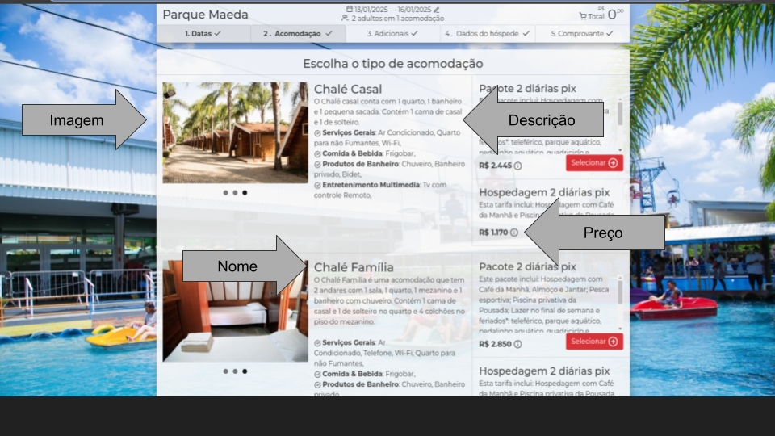

# Test Dev Asksuite

Hey! Glad you're here.
I'm going to explain exactly what you'll have to implement in this test and what we expect as outcome.

First of all, we have this nice express.js boilerplate project to assist you so you don't have to create everything from scratch.

## Briefing
The traveller comes to our bot and asks for "Price quotation". Then the bot asks for the dates the traveller wants to 
stay at the bot's hotel.
At the moment the traveller fills the requested information the bot needs to search the prices for each room available in the check-in/check-out 
timeframe.

You will have to implement the API responsible for doing the searching part.
The necessary information for the crawler is under the [Assets](#assets) session

## What you'll need to do:
* Create a POST endpoint "/search"
    * The expected payload is:
    
        <pre>
        {
            "checkin": "YYYY-MM-DD", // Check-in date
            "checkout": "YYYY-MM-DD" // Check-out date
        }
        </pre>
        
       Example
       
        <pre>
        {
            "checkin": "2021-07-01", 
            "checkout": "2021-07-03"
        }
        </pre>
        
    * The expected result is an array of rooms:
    
        <pre>
        [{
            "name": string, // Room name
            "description": string,  // Room description
            "price": string, // Room daily price
            "image": string, // Room main photo
        }]
        </pre>
        
        Example
        
        <pre>
        [{
            "name": "STUDIO CASAL",
            "description": "Apartamentos localizados no prédio principal do Resort, próximos a recepção e a área de convivência, com vista para área de estacionamento não possuem varanda. Acomoda até 1 adulto e 1 criança ou 2 adultos", 
            "price": "R$ 1.092,00",
            "image": "https://s3.sa-east-1.amazonaws.com/fasthotel.cdn/quartosTipo/214-1-1632320429599483292-thumb.jpg"
        },
        {
            "name": "CABANA",
            "description": "Apartamentos espalhados pelos jardins do Resort, com vista jardim possuem varanda. Acomoda até 4 adultos ou 3 adultos e 1 criança ou 2 adultos e 2 criança ou 1 adulto e 3 crianças, em duas camas casal.", 
            "price": "R$ 1.321,00",
            "image": "https://s3.sa-east-1.amazonaws.com/fasthotel.cdn/quartosTipo/214-1-1632320429599483292-thumb.jpg"
        }]
        </pre>
        
To achieve this result you may:

* With puppeteer, go to the [https://reservations.fasthotel.me/188/214?entrada=2024-08-25&saida=2024-08-27&adultos=1#acomodacoes](#assets)
* Retrieve the needed information to assemble the payload using web crawling methods

## Environment
* Node 10+
* Dotenv setup

Already installed: `express` `puppeteer` `dotenv`

**_Feel free to add any lib you find relevant to your test._**


## Running
* Install dependencies with: `npm install`
* Run as dev: `npm run dev`

Default port is set to `8080`

## Assets
* Crawl URL sample (change dates): 
<pre>https://reservations.fasthotel.me/188/214?entrada=2024-08-25&saida=2024-08-27&adultos=1#acomodacoes</pre>
* Help images:


## Test rating
What do we evaluate with this test?

* Dev's capacity of:
    * Self-learning
    * Working with node
    * Understanding an existent project
* Dev's code quality:
    * Clear and maintainable code
    * Coding structure
    * Changes that don't break easily

### Example

### 🧪 Teste de Requisição com Thunder Client

Após iniciar o servidor com o comando:

```bash
npm run start:dev
```

utilizei a extensão **Thunder Client** do VS Code para realizar um teste de requisição **POST** no endpoint:

```
http://localhost:8080/search
```

#### 🔸 Parâmetros utilizados

Enviei o body com checkin e checkout:

```
{
 "checkin": "2025-11-06", 
 "checkout": "2025-11-08"
}
```

#### 🔸 Resultado

No inicio do teste, o servidor ainda não estava ativo no momento da requisição, resultando em:

```
Connection was refused by the server.
```

O GIF abaixo demonstra o processo de envio da requisição via Thunder Client, simulando o fluxo de teste da API em ambiente local:


# 🧪 Testes Automatizados — API `/search`

Este projeto inclui uma suíte de testes automatizados para validar o comportamento da rota **POST `/search`**, responsável por buscar informações de quartos a partir de um intervalo de datas.

Os testes foram implementados utilizando **Jest** e **Supertest**, garantindo a validação completa de regras de negócio, tratamento de erros e integração com o serviço de busca de quartos (`BrowserService`).

---

## 🚀 Executando os testes

Para rodar todos os testes, basta utilizar o comando:

```bash
npm run test
```

Os testes são executados automaticamente com Jest, simulando requisições HTTP reais por meio do Supertest.

---

## 🧱 Estrutura dos testes

O arquivo de testes principal está localizado em:

```
/tests/search.test.js
```

Ele importa o servidor e o serviço de busca para realizar mocks controlados durante os testes.

```js
const request = require('supertest');
const app = require('../server');
jest.mock('../services/BrowserService', () => ({ searchRooms: jest.fn() }));
```

---

## 📋 Casos de teste cobertos

| Caso                              | Descrição                                            | Resultado esperado                                                  |
| --------------------------------- | ---------------------------------------------------- | ------------------------------------------------------------------- |
| **1️⃣ Body sem datas**            | Quando `checkin` e `checkout` não são enviados       | Retorna `400` e `{ error: 'checkin and checkout are required' }`    |
| **2️⃣ Checkout antes do checkin** | Quando a data de saída é anterior à de entrada       | Retorna `400` e `{ error: 'checkout must be after checkin' }`       |
| **3️⃣ Check-in no passado**       | Quando a data de entrada não é futura                | Retorna `400` e `{ error: 'checkin must be a future date' }`        |
| **4️⃣ Estadia inferior a 2 dias** | Quando o intervalo é menor que duas diárias          | Retorna `400` e `{ error: 'a minimum stay of 2 days is required' }` |
| **5️⃣ Falha no crawler**          | Quando o serviço de busca (`searchRooms`) lança erro | Retorna `500` e `{ error: 'failed to fetch rooms' }`                |
| **6️⃣ Sucesso na busca**          | Quando o serviço retorna resultados válidos          | Retorna `200` e o array com os quartos encontrados                  |

---

## 🧩 Exemplo de mock usado nos testes

O serviço `BrowserService` é simulado com dados fictícios para garantir que os testes não dependam de chamadas externas.

```js
const sampleRooms = [
  {
    name: "STUDIO CASAL",
    description: "Apartamentos localizados no prédio principal do Resort...",
    price: "R$ 1.092,00",
    image: "https://s3.sa-east-1.amazonaws.com/fasthotel.cdn/quartosTipo/214-1-1632320429599483292-thumb.jpg"
  },
  {
    name: "CABANA",
    description: "Apartamentos espalhados pelos jardins do Resort...",
    price: "R$ 1.321,00",
    image: "https://s3.sa-east-1.amazonaws.com/fasthotel.cdn/quartosTipo/214-1-1632320429599483292-thumb.jpg"
  }
];
```

Durante o teste de sucesso:

```js
searchRooms.mockResolvedValue(sampleRooms);
```

---

## ✅ Objetivo dos testes

Os testes garantem que:

* Todas as validações de entrada estão corretas.
* Erros no serviço de busca são tratados adequadamente.
* A resposta segue o formato esperado quando a busca é bem-sucedida.
* O comportamento do servidor é previsível e estável diante de diferentes cenários.

---

## 🧠 Tecnologias utilizadas

* **Node.js**
* **Express**
* **Jest**
* **Supertest**

### 💡 Observação

Esses testes são baseados em mocks e validações de dados. Para testes de integração completos com o crawler real, é necessário remover o mock de `BrowserService` e executar o servidor conectado ao ambiente real.

---


